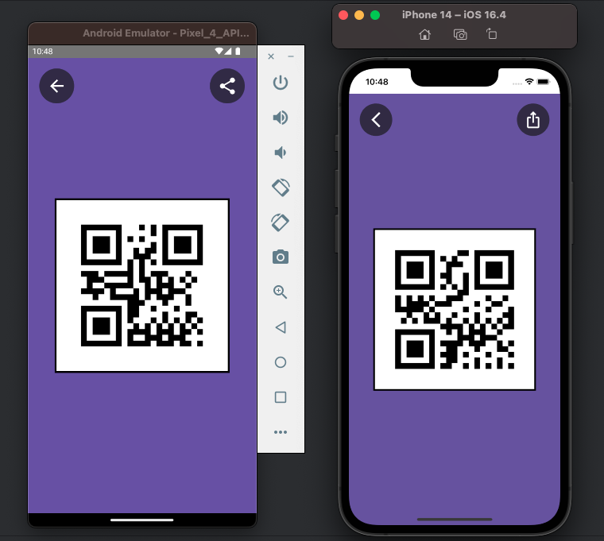

# QR Code App
App that allow you working with QR Code using Kotlin MultiPlatform(KMP) and Compose Multiplatform for Android and iOS.

## Features

   ```text
   [✓] QR Code Generator
   [✓] Share QR Code
   [✓] Store Locally QR Code Data (History)
   [ ] QR Code Scanner
   ```

## Screenshot


https://github.com/lito-bumba/qr-code/assets/90806272/10a08f5c-d11e-4594-9286-ec96885c99fa